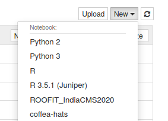

# ROOFIT Hands-on Tutorial Session IndiaCMS2020

## Introduction

This is a tutorial on ROOFIT for the India-CMS 2020 lecture series. They are intended to show you how to build a PDF model and fit binned/unbinned data in ROOFIT (pyROOT). We will try to understand why ROOFIT is useful, how a fit is performed using ROOFIT. We will also see how to import binned(unbinned) data from a ROOT TH1(TTree). We shall learn how to use Workspaces, HistFactory and do simultaneous fitting which are the basic ingredients of the Higgs combine tool. 

## Main notebooks in this tutorial

0. ['setup_libraries.ipynb'](setup_libraries.ipynb): setting up libraries using 'CMSSW'
1. ['Exercise01.ipynb'](Exercise01.ipynb): Creating PDF and generating and fitting data with the model.
2. ['Exercise02.ipynb'](Exercise02.ipynb): Importing ROOT data from 'RooFit'.
3. ['Exercise03.ipynb'](Exercise03.ipynb): Convolution of two pdfs.
2. ['Exercise04.ipynb'](Exercise04.ipynb): Introduction to Workspace in RooFit.
5. ['Exercise05.ipynb'](Exercise05.ipynb): MC template fit.
6. ['Exercise06.ipynb'](Exercise06.ipynb): Simultaneous fit.

## Setup

We will be using the Vanderbilt JupyterHub. Point your browser to:
[https://jupyter.accre.vanderbilt.edu/](https://jupyter.accre.vanderbilt.edu/)

If this is the first time using this JupyterHub, you should see:

<p align="center">

</p>

Click the "Sign in with Jupyter ACCRE" button. On the following page, select CERN as your identity provider and click the "Log On" button. Then, enter your CERN credentials or use your CERN grid certificate to autheticate. Click "Spawn" to start a "Default ACCRE Image v5" image with "8 Cores, 8 GB RAM, 1 day timeout."

Now you should see the JupyterHub home directory. Click on "New" then "Terminal" in the top right to launch a new terminal.

<p align="center">

</p>

To download the tutorials, type
```
git clone https://github.com/ArnabPurohit/ROOFIT_IndiaCMS2020
```

Now, in your directory tab, there should be a new directory called 'ROOFIT_IndiaCMS2020'. All of the tutorials and exercises are in there. Start by clicking on ['setup_libraries.ipynb'](setup_libraries.ipynb) and running it. Please note that the first cell may take up to 20 minutes to run.
Now close this notebook by clicking on 'File->Close and Halt'. Click the "New" button again. You should see a new kernal called 'ROOFIT_IndiaCMS2020'. If you do not, refresh the page and look again.

<p align="center">

</p>

## Notes for working on ACCRE

1. Please remember to close and halt your notebooks when you're done with them. While it's possible to have multiple notebooks open, this can sometimes cause issues with a lack of memory and kernels becoming unstable. The best procatice is to close the notebooks you aren't using. The notebook symbol will be green while it is in use and gray when it is shutdown.
2. Remember to shutdown your server when your are done using it. Go to `Control Panel --> Stop My Server` when you are completely finished.